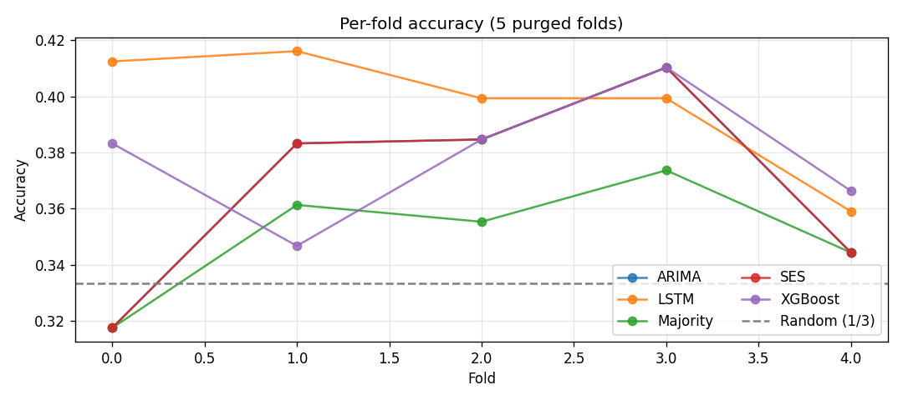
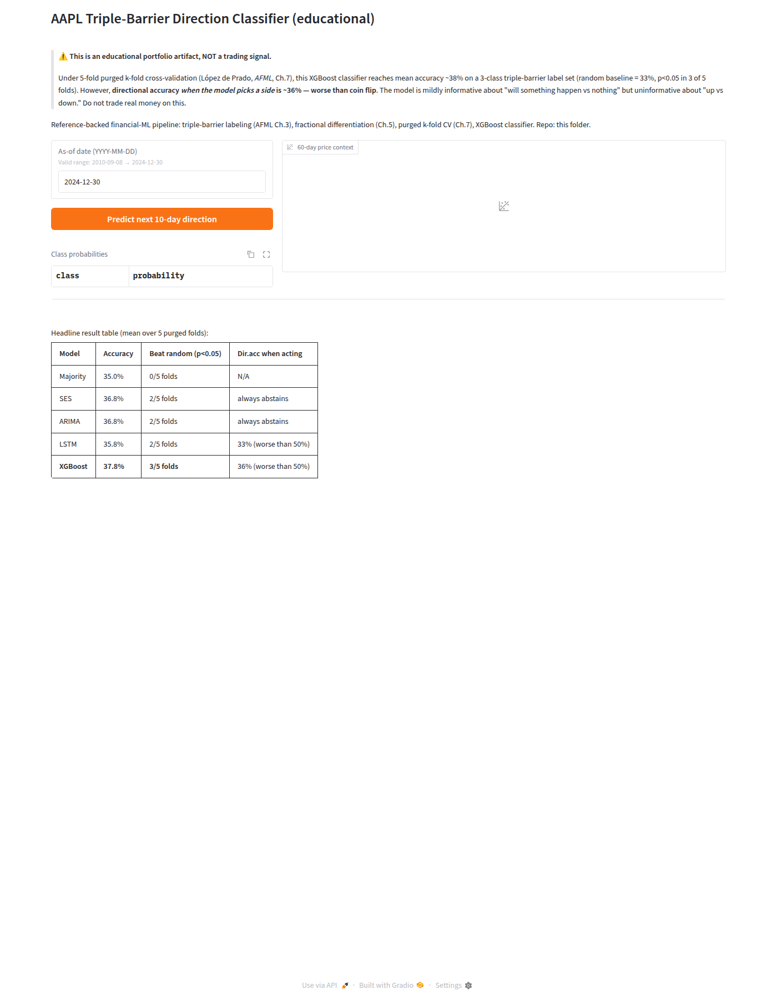

# What I learned trying to forecast AAPL direction with an LSTM

A reference-backed financial-ML study. I started thinking the LSTM was just
poorly tuned. After working through the canonical references it turned out
the *labels* and the *evaluation protocol* were the bigger problems — and
even after fixing those, my refined LSTM is statistically tied with XGBoost
and *neither extracts reliable directional signal at a 10-day horizon*. That
turned out to be the more interesting finding.

This repo is the v2 rebuild of an earlier intern-task notebook (preserved in
[archive/notebooks/](archive/notebooks/) for the before/after contrast). The
work is anchored to specific page references in three sources: López de
Prado's *Advances in Financial Machine Learning* (AFML), Goodfellow et al.'s
*Deep Learning* Ch.10, and Jansen's *Machine Learning for Algorithmic
Trading* Ch.19. The full bibliography is in [docs/REFERENCES.md](docs/REFERENCES.md).

---

## Headline finding

Five models, same 5 purged k-fold splits, same `{-1, 0, +1}` triple-barrier
labels on ~1,400 events drawn from AAPL daily bars (2010-2024). One run:

| Model | Mean accuracy | Beats random (p<0.05) | Dir. acc *when acting* |
|---|---:|---:|---:|
| Majority baseline | 35.0% | 0 / 5 folds | — |
| SES | 36.8% | 2 / 5 folds | always abstains |
| ARIMA | 36.8% | 2 / 5 folds | always abstains |
| Refined LSTM (32→16, `clipnorm=1.0`, softmax-3) | 36–40% | 2–4 / 5 folds | 33–36% |
| XGBoost (max_depth=4, n=300) | 37.8% | 3 / 5 folds | 36% |

Random baseline is 1/3 = 33.3% for accuracy and 1/2 = 50% for directional
accuracy when the model chooses to act. **LSTM and XGBoost are statistically
tied within noise** — across re-runs (TF non-determinism on CPU), the LSTM
ranges from slightly below to slightly above XGBoost, both ~3 points above
the majority baseline. **All five models have directional accuracy *below*
50% when they pick a side** — they're modestly informative about "will
*something* happen" but *uninformative* about up-vs-down direction. That's
the honest result, and it's more useful than a false positive.



---

## What I built (and why each piece exists)

Every choice below was made *because* a specific reference said the alternative
fails. The implementation lives in [src/](src/).

1. **Triple-barrier labels** ([src/labeling.py](src/labeling.py))
   AFML Ch.3 (BonusPDF pp.26–34). Replaces the original notebook's
   `target_return = log_return.shift(-1)` fixed-horizon label, which AFML
   Table 1.2 lists as Pitfall #5. Each event gets a profit-taking, stop-loss,
   and time-out barrier; the label is which barrier hits first.

2. **Fractional differentiation features** ([src/features.py](src/features.py))
   AFML Ch.5 §5.4 (BonusPDF pp.46–55). Replaces raw `log_return` with
   `frac_diff_ffd(log_close, d≈0.4)`, which is stationary (passes ADF) *and*
   preserves long memory of past prices. Log-returns destroy that memory; this
   is AFML Pitfall #4.

3. **Purged k-fold CV with embargo** ([src/cv.py](src/cv.py))
   AFML Ch.7 (BonusPDF pp.62–67). Replaces the original notebook's single
   chronological train/val/test split. Standard k-fold leaks information in
   finance because labels span intervals; purging drops training samples whose
   label-interval overlaps a test sample. AFML Pitfall #8.

4. **Refined LSTM** ([src/models/lstm_model.py](src/models/lstm_model.py))
   `LSTM(32) → LSTM(16) → Dense(3, softmax)`, `Adam(lr=1e-3, clipnorm=1.0)`,
   `recurrent_dropout=0.1`, `categorical_crossentropy`. The `clipnorm` comes
   from Goodfellow §10.11.1 eq 10.48-49 (PDF p.414) — without it, the 60-step
   BPTT chain catastrophically diverges on the "cliff" loss landscape from
   figure 10.17. The downsizing from the original 128→64 follows Jansen
   Ch.19 NB 01 (10 units on S&P) and Karpathy's generalization warning.

5. **XGBoost classifier** ([src/models/xgb_model.py](src/models/xgb_model.py))
   Per Jansen Ch.12 — GBMs are the canonical strong baseline on small
   tabular financial datasets and routinely beat LSTMs.

---

## Why LSTM and XGBoost ended up tied

Three reasons, in order of impact:

1. **The signal isn't there to begin with**. Directional accuracy below 50%
   when either model picks a side isn't a model-capacity problem — it's a
   label-structure problem. The triple-barrier `0` class (time-out) carries
   some learnable structure (vol/regime context) but the `-1`/`+1`
   discrimination is essentially random over a 10-day horizon. That fits a
   body of literature on equity return forecasting. Whichever architecture
   you throw at it, the ceiling is the same.

2. **Sample efficiency**. After CUSUM event sampling and triple-barrier
   labeling, the dataset is ~1,400 events. The LSTM has ~3,000 parameters
   and ~1,000 training events per fold — close to the edge of
   underdetermined. XGBoost's regularization is more effective at this
   regime; per Jansen Ch.12, GBMs are the canonical strong baseline on
   small tabular financial datasets.

3. **Calendar features should be embeddings, not scalars**. The LSTM gets
   `day_of_week` as an integer; per Jansen Ch.19 NB 02 it should be an
   `Embedding(7, 2)` layer. Future-work item that might push the LSTM
   clearly above XGBoost — or might not, if reason #1 is the binding
   constraint.

---

## What I tried and discarded

- **Original LSTM training collapsed to predicting the mean.** Goodfellow
  §10.11 diagnosis: no gradient clipping on a 60-step BPTT chain. MSE loss
  is also misaligned with the directional-accuracy metric — what minimizes
  MSE on near-zero-mean returns is the unconditional mean.
- **5-day vertical barrier** gave 14/66/20% class balance (mostly time-outs).
  Widened to 10 days for 26/37/37%, close to balanced.
- **Single static `StandardScaler` fit on 2010-2021** in the original notebook
  carries stale statistics into the 2022+ test set, which spans regime change.
  Each fold now fits its own scaler in [src/train.py](src/train.py).
- **Rolling-eval protocol asymmetry** in the original: ARIMA refits every 5
  days but the LSTM never refit. The "SES beats LSTM" finding from that
  notebook didn't replicate under fair purged CV.

---

## Reproduce in 3 commands

```bash
git clone <this-repo> DataSynth && cd DataSynth
python -m venv .venv && .venv/bin/pip install -r requirements.txt
.venv/bin/jupyter nbconvert --to notebook --execute --inplace \
    notebooks/AAPL_Triple_Barrier_Forecasting.ipynb
```

End-to-end completes in ~15 min on CPU. Outputs land in
[reports/tables/refined_model_comparison.csv](reports/tables/refined_model_comparison.csv)
and [reports/figures/](reports/figures/).

To launch the Gradio inference demo:

```bash
.venv/bin/python src/app.py   # → http://127.0.0.1:7860
```



---

## Repo map

```
DataSynth/
├── notebooks/
│   └── AAPL_Triple_Barrier_Forecasting.ipynb   # the executed notebook
├── src/                                         # reference-anchored modules
│   ├── labeling.py        # AFML Ch.3 (triple-barrier)
│   ├── features.py        # AFML Ch.5 (FFD)
│   ├── cv.py              # AFML Ch.7 (PurgedKFold)
│   ├── data.py, train.py, eval.py
│   ├── app.py             # Gradio inference demo
│   └── models/            # Naive, SES, ARIMA, XGBoost, LSTM wrappers
├── data/raw/              # OHLCV CSVs for AAPL, SPY, AMZN, GOOGL, MSFT
├── reports/
│   ├── figures/           # 3 + screenshots (hero charts)
│   ├── tables/            # final comparison CSVs
│   ├── REPORT.md          # technical writeup
│   └── docs/learning_journal.{pdf,docx}   # narrative blog kept during the project
├── docs/
│   ├── LESSONS_LEARNED.md
│   └── REFERENCES.md
├── archive/               # the v1 (intern-era) notebook and its artifacts
└── configs/, requirements.txt, LICENSE
```

---

## Future work

If this becomes a research project rather than a portfolio piece, the next
moves are (with references):

- **Combinatorial purged CV** (AFML Ch.12) — provides multiple back-test paths
  from the same data, reduces backtest overfitting more aggressively than
  single-path purged k-fold.
- **Sample-uniqueness weighting** (AFML Ch.4 Snippet 4.1) — current
  implementation uses an approximate weight; the exact algorithm reweights
  overlapping labels proportionally.
- **Meta-labeling** (AFML Ch.3.6) — train a primary model for "side" and a
  secondary for "act/don't act"; often improves precision at the cost of recall.
- **Tick or dollar bars** (AFML Ch.2) — daily bars have a fixed sampling
  frequency that doesn't match information flow. Event-driven bars are
  closer to i.i.d.
- **Calendar embeddings on the LSTM** (Jansen Ch.19 NB 02).
- **Out-of-sample test on 2025+ AAPL data** — pull fresh OHLCV and predict
  forward to validate the comparison holds.

---

## License & context

[MIT](LICENSE). Built by a Data Science MSc student as a portfolio piece. If
you found this useful, the [lessons-learned doc](docs/LESSONS_LEARNED.md)
captures the first-person learning narrative, and
[REFERENCES.md](docs/REFERENCES.md) lists the full bibliography with page
citations.
