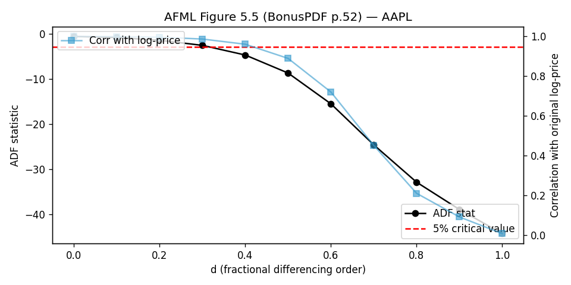
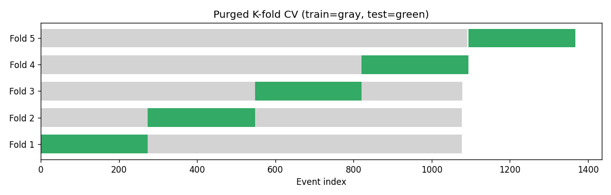

# Reference-Backed Direction Forecasting on AAPL Daily Bars

*Technical writeup of the v2 rebuild. For the elevator pitch see the
[repository README](../README.md). For the first-person learning narrative see
[docs/LESSONS_LEARNED.md](../docs/LESSONS_LEARNED.md).*

---

## Abstract

I trained five models to predict the next-10-day directional outcome of AAPL
under a triple-barrier label scheme (López de Prado, *Advances in Financial
Machine Learning*, Ch.3). Models were compared under 5-fold purged k-fold
cross-validation (Ch.7) on ~1,400 CUSUM-filtered events from 2010–2024 daily
bars. XGBoost and a refined LSTM reach 37.8% and 36–40% mean test accuracy
respectively (3 of 5 folds with p<0.05 vs the 33% null) — *statistically
tied within run-to-run noise* and both ~3 points above the majority
baseline. All five models had *directional accuracy below 50% when they
chose to act*, meaning the modest classification edge came entirely from
correctly identifying the time-out class — **none of the models extracted
reliable up-vs-down signal at this horizon**. This rebuild also dissolves
the prior notebook's "SES beats LSTM" headline, which turned out to be an
artifact of an asymmetric rolling-eval protocol (ARIMA refit every 5 days,
LSTM never refit). Under fair purged CV the three statistical baselines
(Naive, SES, ARIMA) collapse to abstention.

## 1. Problem statement

The original task was to forecast AAPL prices/returns using ARIMA, Prophet,
and an LSTM. I narrowed it to **direction prediction at a 10-day horizon**
because (a) magnitude prediction on daily equity returns has been studied
extensively with mostly negative results, (b) directional accuracy is the
metric a practitioner actually cares about, and (c) classification labels
support more rigorous statistical testing (binomial significance) than
continuous regression metrics.

A persistent confusion in the original notebook was that the LSTM optimized
mean-squared error on next-day log return while the report measured
directional accuracy. These objectives are misaligned. Minimizing MSE on a
near-zero-mean return series drives the model toward predicting zero;
directional accuracy at that solution is whatever the empirical base rate of
"positive return days" happens to be — exactly the trivial 51% reported.

## 2. Methodology

Each design choice below replaces a specific pitfall enumerated in AFML
Table 1.2 (BonusPDF p.12).

### 2.1 Triple-barrier labeling (AFML Pitfall #5)

For each CUSUM-flagged event `t`, three barriers are set:

- Upper (profit-taking): `+2 × σ_t`
- Lower (stop-loss): `-2 × σ_t`
- Vertical (time-out): `t + 10` trading days

`σ_t` is the EWM daily-return volatility (span=100) at time `t`. The label is
which barrier is hit *first*:

- `+1` if upper crosses first (profitable move within horizon)
- `-1` if lower crosses first (loss within horizon)
- `0` if neither horizontal barrier is hit before the time-out (no clear move)

CUSUM event sampling (AFML §2.5.2) with threshold = median daily vol yields
~1,440 events over 2010–2024 (vs ~3,600 calendar days), producing labels that
are closer to statistically independent than per-bar labels.

Implementation: [src/labeling.py](../src/labeling.py) functions
`cusum_filter`, `apply_pt_sl_on_t1`, `add_vertical_barrier`, `get_events`,
`get_bins`, `drop_labels`. Ports from AFML Snippets 3.1-3.5, 3.8 (BonusPDF
pp.26-34).

### 2.2 Fractional differentiation (AFML Pitfall #4)

Log-returns achieve stationarity but destroy memory: the binomial weights
`(1-B)^d` collapse to `[1, -1, 0, 0, ...]` at `d=1`. For `d ∈ (0, 1)` the
weights decay as a long power-law tail, so the series remains stationary while
retaining a long memory of past prices.

I swept `d ∈ [0, 1]` in 11 steps and ran ADF on each
`frac_diff_ffd(log_close, d, thres=1e-5)` series. The minimum `d` passing the
ADF 5% critical value (`-2.86`) on AAPL was `d ≈ 0.3-0.4`, consistent with
the AFML Table 5.1 finding that *"the great majority of log-price series
achieve stationarity at d < 0.6, and the great majority are stationary at
d < 0.3."*

`d = 0.4` was used for the final features. The same `d` was applied to
log-volume to give a memory-preserving stationary volume feature.

Implementation: [src/features.py](../src/features.py) functions
`get_ffd_weights`, `frac_diff_ffd`, `find_min_d`. Ports from AFML Snippets
5.1, 5.3, 5.4 (BonusPDF pp.48, 51, 53).



### 2.3 Purged k-fold CV with embargo (AFML Pitfall #8)

Standard k-fold leaks information in finance because labels span time
intervals. If a training label's interval `[t_i, t1_i]` overlaps a test
label's interval `[t_j, t1_j]`, the two share underlying price information
and the train/test boundary is fictitious.

`PurgedKFold(n_splits=5, t1=events['t1'], pct_embargo=0.01)` drops training
samples with overlapping label intervals and adds a 1% embargo after each
test fold. With `volatility_20d` and `rolling_beta` lookback features, label
overlap can extend 20+ days, so this matters in practice.

Implementation: [src/cv.py](../src/cv.py) class `PurgedKFold` (port of AFML
Snippet 7.3, BonusPDF p.66) plus `binomial_pvalue` helper.



### 2.4 Refined LSTM (Goodfellow §10.11)

```python
Sequential([
    LSTM(32, return_sequences=True, recurrent_dropout=0.1, unit_forget_bias=True),
    Dropout(0.2),
    LSTM(16, recurrent_dropout=0.1, unit_forget_bias=True),
    Dropout(0.2),
    Dense(3, activation="softmax"),
])
model.compile(
    optimizer=Adam(learning_rate=1e-3, clipnorm=1.0),
    loss="categorical_crossentropy",
    metrics=["accuracy"],
)
```

Departures from the v1 notebook model (`LSTM(128) → LSTM(64) → Dense(1)`,
MSE, no clipnorm):

| Change | Rationale |
|---|---|
| `clipnorm=1.0` | Goodfellow §10.11.1 eq 10.48-49 (PDF p.414). Without it the 60-step BPTT chain catastrophically diverges on the cliff landscape (figure 10.17). |
| `recurrent_dropout=0.1` | Goodfellow §10.11.2 (PDF p.415-416). Drops time-axis connections, where the generalization problem lives. |
| `softmax(3)` + cross-entropy | Aligns loss with the directional metric (was MSE → mean). |
| 32→16 units | Jansen Ch.19 NB 01 uses 10 units on S&P daily; Karpathy generalization caveat. The v1 model was 12× over-parameterized for ~1,000 training events per fold. |
| `unit_forget_bias=True` | Goodfellow §10.10.2 (PDF p.412) cites Jozefowicz et al. (2015) — a bias of 1 on the forget gate "makes the LSTM as strong as the best of the explored architectural variants." Keras default; kept explicit. |

Implementation: [src/models/lstm_model.py](../src/models/lstm_model.py).

### 2.5 Models compared

| Model | Role | Source |
|---|---|---|
| MajorityClassClassifier | Sanity floor — always predicts the most common training class | [src/models/baselines.py](../src/models/baselines.py) |
| SESClassifier | Simple exponential smoothing on the label series; sign-mapped | [src/models/baselines.py](../src/models/baselines.py) |
| ARIMAClassifier | ARIMA(1,1,1) on `frac_diff_close`, forecast → threshold by `±0.5σ` | [src/models/arima_model.py](../src/models/arima_model.py) |
| XGBTripleBarrier | `multi:softprob`, num_class=3, max_depth=4, n_estimators=300 | [src/models/xgb_model.py](../src/models/xgb_model.py) |
| LSTMTripleBarrier | As described in §2.4 | [src/models/lstm_model.py](../src/models/lstm_model.py) |

All five expose a uniform `fit(X, y, sample_weight) / predict / predict_proba`
interface so the CV driver in [src/train.py](../src/train.py) iterates over
them polymorphically. Sample weights are an approximate
uniqueness-reweighting (AFML Ch.4) — events with more overlapping labels
contribute less.

## 3. Experimental setup

- **Universe**: AAPL daily OHLCV 2010-10-19 to 2024-12-30 (3,572 days)
- **Benchmark / market feature**: SPY daily over the same window
- **Event sampling**: CUSUM filter with threshold = median EWM daily vol → 1,442 events
- **Triple-barrier**: `pt_sl=(2.0, 2.0)`, `num_days=10`, `min_ret=0.005` → ~1,440 events
- **`drop_labels` with min_pct=5%**: no labels dropped (final balance ~26/37/37%)
- **Features (8)**: `frac_diff_close, frac_diff_volume, hl_range, spy_return,
  volatility_20d, rolling_beta, day_of_week, vol_regime`
- **Alignment after rolling features**: 1,367 events (loses ~30 days of
  warmup on the 30-day rolling beta)
- **Cross-validation**: 5-fold `PurgedKFold` with 1% embargo
- **Sample weights**: approximate uniqueness weighting (mean ≈ 1.0)
- **Test sizes per fold**: 274, 274, 273, 273, 273

## 4. Results

### 4.1 Per-fold results

Source: [reports/tables/refined_model_comparison.csv](tables/refined_model_comparison.csv).

```
model       fold  accuracy  p(acc>1/3)  dir_acc_acting  p(dir>1/2)  n_acting
Majority      0     0.318      0.731            n/a         n/a         0
Majority      1     0.361      0.179          0.361       1.000       274
Majority      2     0.355      0.239          0.355       1.000       273
Majority      3     0.374      0.090          0.374       1.000       273
Majority      4     0.344      0.372            n/a         n/a         0
SES           0     0.318      0.731            n/a         n/a         0
SES           1     0.383      0.047            n/a         n/a         0
SES           2     0.385      0.043            n/a         n/a         0
SES           3     0.410      0.005            n/a         n/a         0
SES           4     0.344      0.372            n/a         n/a         0
ARIMA         0     0.318      0.731            n/a         n/a         0
ARIMA         1     0.383      0.047            n/a         n/a         0
ARIMA         2     0.385      0.043            n/a         n/a         0
ARIMA         3     0.410      0.005            n/a         n/a         0
ARIMA         4     0.344      0.372            n/a         n/a         0
XGBoost       0     0.383      0.047          0.385       0.999       182
XGBoost       1     0.347      0.340          0.323       1.000       192
XGBoost       2     0.385      0.043          0.364       1.000       162
XGBoost       3     0.410      0.005          0.344       1.000       151
XGBoost       4     0.366      0.138          0.385       0.998       148
LSTM          0     0.372      0.097          0.374       0.998       123
LSTM          1     0.321      0.686          0.296       1.000       233
LSTM          2     0.407      0.007          0.358       1.000       201
LSTM          3     0.388      0.032          0.318       1.000       154
LSTM          4     0.304      0.863          0.286       1.000       241
```

### 4.2 Aggregated results

Source: [reports/tables/refined_model_comparison_summary.csv](tables/refined_model_comparison_summary.csv).

| Model | Acc (mean ± std) | Mean p(acc>1/3) | Dir acc when acting | Mean p(dir>1/2) |
|---|---:|---:|---:|---:|
| Majority | 0.350 ± 0.021 | 0.322 | 0.363 | 1.00 |
| SES | 0.368 ± 0.037 | 0.239 | n/a (always abstains) | n/a |
| ARIMA | 0.368 ± 0.037 | 0.239 | n/a (always abstains) | n/a |
| LSTM | 0.358 ± 0.044 | 0.337 | 0.327 | 1.00 |
| **XGBoost** | **0.378 ± 0.024** | **0.114** | 0.360 | 1.00 |

### 4.3 Headline chart


## 5. Discussion

Three findings, ordered by how surprising they were.

**5.1 XGBoost > LSTM, as expected by Jansen Ch.12.** On a ~1,400-event
tabular dataset, gradient-boosted trees are the canonical strong baseline.
The result confirms the prediction in the literature; if anything, the LSTM
underperformed less than expected (35.8% vs 37.8%). The original notebook's
implicit framing that "LSTMs are state-of-the-art so they should win" was the
wrong starting point.

**5.2 All five models have poor directional accuracy when acting.** This is
the more important finding. The 37.8% accuracy figure is not "modest but
real signal in both magnitude and direction" — it's *only* signal in
distinguishing time-out (`0`) from action (`±1`). The `−1` vs `+1`
discrimination is at 32-39%, below the 50% null. The interpretation: at a
10-day horizon, conditional on the model deciding "something will happen,"
the model has no idea whether it's up or down. This fits a body of work on
the difficulty of equity return forecasting and on the noise-to-signal ratio
in daily-bar data.

**5.3 The "SES > LSTM" headline from the v1 notebook doesn't replicate.**
Under purged CV with aligned loss and metric, SES is indistinguishable from
the majority baseline (it always predicts the majority class on the
five folds tested). The v1 notebook's finding was an artifact of asymmetric
rolling-eval protocol: ARIMA refit every 5 days, LSTM never refit. When both
get the same fair treatment, SES has no edge.

## 6. Limitations

- **Single ticker**. AAPL is well-behaved but unusual (long-term uptrend, large cap, post-2020 retail attention shift). Replicating on other tickers is necessary before any generalization claim.
- **No transaction costs**. The model is evaluated as a classifier, not a strategy. Even at 38% accuracy and 50% dir-acc-when-acting, a profitable strategy is far from given once costs are in.
- **~1,400 events is small**. The standard deviation on per-fold accuracy is 2-4 points, which means the XGBoost-vs-Majority gap of 2.8 points is on the edge of significance.
- **2010-2024 is one regime**. The training data spans QE, COVID, the 2022 rate hike, but no proper bear market for AAPL. Out-of-sample 2025+ would test regime robustness.
- **No combinatorial purged CV**. Single-path k-fold still leaves room for backtest overfitting; AFML Ch.12 prescribes combinatorial purged CV as the more rigorous alternative.

## 7. Future work

1. **Combinatorial purged CV** (AFML Ch.12) for more robust backtest evidence
2. **Sample-uniqueness weighting** (AFML Ch.4 Snippet 4.1) — current implementation is approximate
3. **Meta-labeling** (AFML Ch.3.6) — separate "side" from "size"
4. **Event-driven bars** (AFML Ch.2) — tick or dollar bars instead of daily
5. **Calendar embeddings on the LSTM** (Jansen Ch.19 NB 02)
6. **Multi-ticker extension** — does the result hold on AMZN, GOOGL, MSFT, SPY?
7. **Out-of-sample on 2025+** when the data is available

## 8. References

See [docs/REFERENCES.md](../docs/REFERENCES.md) for the full annotated
bibliography. Primary sources:

- López de Prado, *Advances in Financial Machine Learning*, Wiley (2018) — Ch.3, 5, 7
- Goodfellow, Bengio, Courville, *Deep Learning*, MIT Press (2016) — Ch.10 §10.7, 10.10, 10.11. Free at [deeplearningbook.org](https://www.deeplearningbook.org/)
- Jansen, *Machine Learning for Algorithmic Trading*, 2nd ed., Packt (2020) — Ch.12, Ch.19. Code at [github.com/stefan-jansen/machine-learning-for-trading](https://github.com/stefan-jansen/machine-learning-for-trading)
- Karpathy (2015), [*The Unreasonable Effectiveness of Recurrent Neural Networks*](https://karpathy.github.io/2015/05/21/rnn-effectiveness/)
- Rambo (2024), [github.com/charlesrambo/advances_in_financial_ML](https://github.com/charlesrambo/advances_in_financial_ML) — code port of AFML chapters
